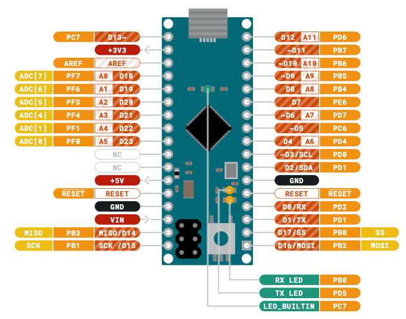
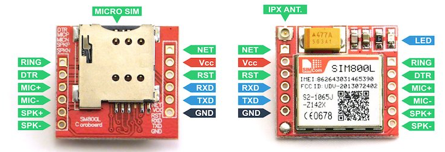

# Purpose

Purpose of this project is to create simple monitoring based on Arduino Micro, SIM800L board and PIR sensors. I want to be able to feed MQTT server topics constantly with data from PIR sensors and in case of "alarm" situation I will ... I don't really know what then, but with GSM/GPRS module already in place I can easily send text to myself at least. 

# Inspirations

First inspiration was apartment with "abandoned" alarm installation I've seen lately. I was wondering how it's built since previous service provider left whole infrastructure in place, and just removed communication module. Then in order following resources were useful: 
 * When I started to dig through internet I found [this](https://www.enigma14.eu/wiki/5V_UPS_for_Raspberry_Pi) article describing how to utilise 12V battery which was part of infrastructure left in "abandoned" alarm installation. 
 * Then I found [this](https://www.pushsafer.com/en/pushapi#api-read) app allowing to send push notification to your phone. 
 * Original article was describing installation with Raspberry Pi, but after some more research I decided I'll go with Arduino Micro (which I have multiple spare copies in my treasures box) so [this](https://content.arduino.cc/assets/Pinout-Micro_latest.pdf) piece of documentation is obvious help when working with this project. 
 * Since I've never played with MQTT before [this awesome list](https://github.com/hobbyquaker/awesome-mqtt) was pretty useful to have some first glance about available resources. 
 * [This section of article](https://lastminuteengineers.com/sim800l-gsm-module-arduino-tutorial/#wiring-sim800l-gsm-module-to-arduino-uno) was very useful when connecting SIM800L module to Arduino Micro. One worth noticing that for Micro you should change pins due to [Limitations section here](https://www.arduino.cc/en/Reference/softwareSerial).
* Also [pins description](https://forum.arduino.cc/index.php?topic=525769.0) for SIM800L module was useful. [This one](https://www.electroschematics.com/introducingsim800l/) I used to set logic level voltages. 
* Since I needed to lower 5V to 3.3V I had to ensure that I do it correctly with [picture from this Quora topic](https://www.quora.com/How-many-pins-on-Arduino-Uno-give-a3-3v-pin-output). 

# Tests

As all projects I start with tests of component concepts. 

## Alarm

In [alarm directory](./tests/alarm) there is simple test related to testing [PIR sensors](https://www.paradox.com/Products/default.asp?CATID=8&SUBCATID=80&PRD=34) I bought. Code was written using simple [INPUT_PULLUP built-in examples](https://www.arduino.cc/en/Tutorial/InputPullupSerial) from Arduino creators. 

## Sim

In [sim directory](./tests/sim) there is test of SIM800L module if it works. I was using [this section of this amazing article](https://lastminuteengineers.com/sim800l-gsm-module-arduino-tutorial/#arduino-code-testing-at-commands) and later I also tested second code example to send SMS (not included in repo though). 

# Shematics

## Pins

Usefull resource are pins documentation, so here it goes!

### Arduino Micro

### SIM800L

